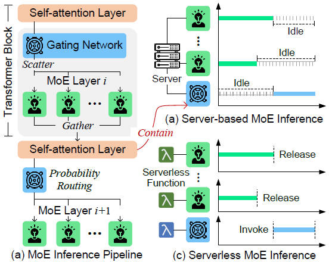
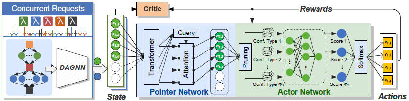
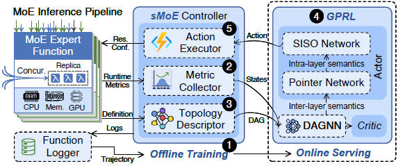
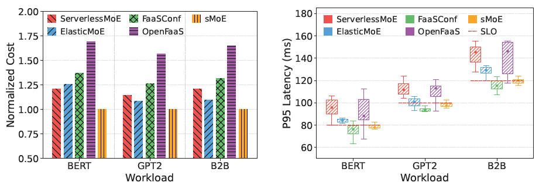

# sMoE: Elastic Mixture-of-Experts Inference with Fine-Grained Serverless Scaling

<p align="center">
  
</p>

sMoE is a topology-aware, deep-reinforcement-learning–based auto-scaler for serverless Mixture-of-Experts (MoE) inference. It jointly optimizes vertical resources, replica counts, and expert-level concurrency, enabling cost-efficient and SLO-compliant inference under dynamic expert popularity and concurrent request patterns.

<p align="center">
  
</p>

sMoE models the MoE inference pipeline as a directed acyclic graph (DAG) of experts and non-MoE segments, and uses a hybrid DAGNN + Pointer Network reinforcement learning model to generate fine-grained scaling actions for each expert.

---

## System Overview

<p align="center">
  
</p>

- **Fine-Grained Expert Decisions**  
  Learns per-expert configurations including CPU/GPU share, memory limits, replica count, and concurrency.

- **Topology-Aware Expert Scaling**  
  Uses a DAGNN encoder to propagate cross-layer expert dependencies and model dynamic critical paths.

- **Pointer-Guided Intra-Layer Coordination**  
  Captures skewed, time-varying expert popularity and mitigates stragglers.

- **End-to-End SLO Guarantees**  
  Optimizes scaling while meeting stringent P95 latency objectives.

---

## Requirements

```bash
pip install torch 
pip install numpy 
pip install pyyaml 
pip install prometheus-api-client
pip install networkx 
pip install kubernetes
pip install tqdm
```

### System Dependencies
- Kubernetes ≥ 1.20  
- OpenFaaS  
- NVIDIA GPU + MPS  
- Prometheus  

---

## Usage

### 1. Build DAG  
Construct the MoE pipeline graph from a YAML description.

```python
from smoelib.topology import build_dag

# Load pipeline structure (experts, layers, dependencies)
dag = build_dag(
    config="pipeline.yml",
    validate=True,             # ensure DAG consistency
    attach_metadata=True       # load per-expert resource specs
)
```
### 2. Initialize Controller

Create the sMoE controller with Prometheus metrics and action space configs.

```python
from smoelib.controller import SMoEController

controller = SMoEController(
    dag=dag,
    config="config.yaml",        # RL model + action space + limits
    prometheus_url="http://prometheus:9090",
    dry_run=False,               # True: print actions only
    log_interval=10,             # seconds between info logs
    warmup_seconds=30            # wait before issuing first action
)
```

### 3. Start Scaling Loop

Begin the continuous control cycle with a fixed decision interval.

```python
# Execute the control loop (fetch → encode → predict → apply)
controller.run(
    interval=5,            # seconds per control step
    max_steps=None,        # None = run indefinitely
    verbose=True           # print decisions to console
)
```

---

## Evaluation
Across BERT, GPT2, and Bert2Bert variants, sMoE delivers consistently lower cost while keeping P95 latency close to the SLO.
It adapts well to bursty traffic and shifting expert popularity, leading to more stable performance compared to existing autoscalers.

<p align="center">
  
</p>

| Metric | Improvement |
|-------|-------------|
| Cost Reduction | **21.4% – 39.2%** |
| P95 Latency | Within **2.7% of SLO** |
| Violation Rate | Much lower vs ElasticMoE / FaaSConf |

---

## Reference

- [DeepSpeed-MoE: Advancing Mixture-of-Experts Inference for Large Models](https://proceedings.mlr.press/v162/rajbhandari22a/rajbhandari22a.pdf)
- [Optimizing Distributed Deployment of Mixture-of-Experts Model Inference in Serverless Computing](https://arxiv.org/abs/2501.05313)
- [ElasticMoE: An Efficient Auto-Scaling Method for Mixture-of-Experts Models](https://arxiv.org/abs/2510.02613)
- [Toward Efficient Inference for Mixture of Experts](https://openreview.net/forum?id=stXtBqyTWX)
- [MoBiLE: Efficient Mixture-of-Experts Inference on Consumer GPU with Mixture of Big-Little Experts](https://arxiv.org/abs/2510.12357)
